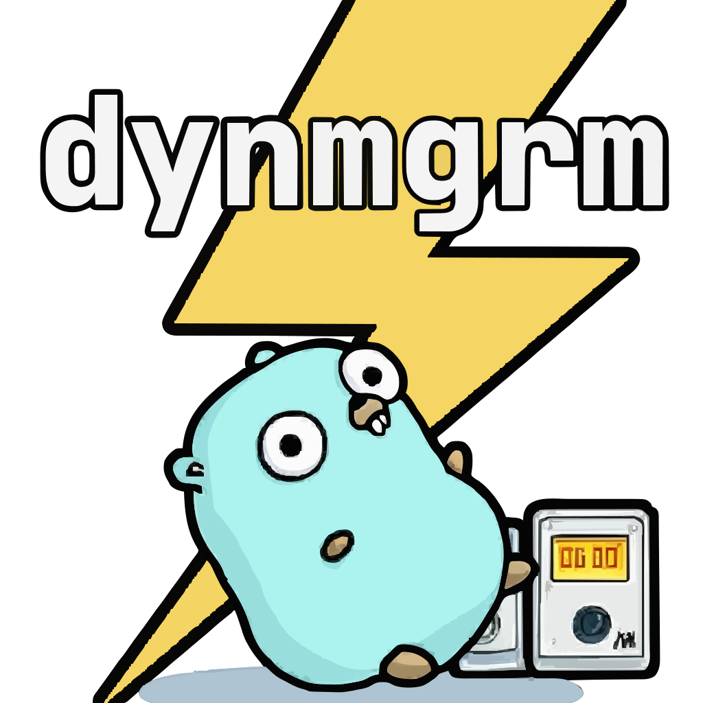

# dynmgrm - GORM DynamoDB Driver



[](https://pkg.go.dev/github.com/miyamo2/dynmgrm)
[](https://img.shields.io/github/go-mod/go-version/miyamo2/dynmgrm?logo=go)
[](https://img.shields.io/github/v/release/miyamo2/dynmgrm)
[](https://codecov.io/gh/miyamo2/dynmgrm)
[](https://goreportcard.com/report/github.com/miyamo2/dynmgrm)
[](https://img.shields.io/github/license/miyamo2/dynmgrm?&color=blue)

## Features

Supports the following PartiQL statements:

- [x] Select
  - [x] With Secondary Index
  - [x] With `begins_with` function
  - [x] With `contains` function
  - [x] With `size` function
  - [x] With `attribute_type` function
  - [x] With `MISSING` operator
- [x] Insert
- [x] Update
  - [x] With `SET` clause
    - [x] With `list_append` function
      - [x] `ListAppend()`
    - [x] With `set_add` function
    - [x] With `set_delete` function
  - [ ] With `REMOVE` clause
- [x] Delete
- [x] Create Table ※ proprietary PartiQL syntax by [`btnguyen2k/godynamo`](https://github.com/btnguyen2k/godynamo)
- [ ] Create Index ※ proprietary PartiQL syntax by [`btnguyen2k/godynamo`](https://github.com/btnguyen2k/godynamo)

Supports the following GORM features:

- Query
  - [x] `Select`
  - [x] `Find`
  - [x] `Scan`

- Update
  - [x] `Update`
  - [x] `Updates`
  - [x] `Save`

- Create
  - [x] `Create`
  
- Delete
  - [x] `Delete`

- Condition
  - [x] `Where`
  - [x] `Not`
  - [x] `Or`

- Table/Model
  - [x] `Table`
  - [x] `Model` ※ Combination with Secondary Index are not supported.
  
- Transaction ※ Supports only Insert, Update, and Delete.
  - [x] `Begin`
  - [x] `Commit`
  - [x] `Rollback`
  - [x] `Transaction`

- [Migration](.docs/MODEL.md)
  - [ ] `AutoMigrate`
  - [ ] `CurrentDatabase`
  - [x] `FullDataTypeOf`
  - [x] `CreateTable`
  - [ ] `DropTable`
  - [ ] `HasTable`
  - [ ] `GetTables`
  - [ ] `HasColumn`
  - [ ] `ColumnTypes`
  - [ ] `CreateIndex`
  - [ ] `DropIndex`
  - [ ] `HasIndex`

Custom Clause:

- `SecondaryIndex`

Custom Data Types:

- `Set[string | int | float64 | []byte]`

- `List`

- `Map`

- `TypedList[T]`

## Quick Start

### Installation

```sh
go get github.com/miyamo2/dynmgrm
```

### Usage

```go
package main

import (
	"github.com/miyamo2/dynmgrm"
	"gorm.io/gorm"
)

type Event struct {
	Name  string `gorm:"primaryKey"`
	Date  string `gorm:"primaryKey"`
	Host  string
	Guest dynmgrm.Set[string]
}

func main() {
	db, err := gorm.Open(dynmgrm.New())
	if err != nil {
		panic(err)
	}

	var dynamoDBWorkshop Event
	db.Table("events").
		Where(`name=?`, "DynamoDB Workshop").
		Where(`date=?`, "2024/3/25").
		Scan(&dynamoDBWorkshop)

	dynamoDBWorkshop.Guest = append(dynamoDBWorkshop.Guest, "Alice")
	db.Save(&dynamoDBWorkshop)

	carolBirthday := Event{
		Name: "Carol's Birthday",
		Date: "2024/4/1",
		Host: "Charlie",
		Guest: []string{"Alice", "Bob"},
	}
	db.Create(carolBirthday)

	var daveSchedule []Event
	db.Table("events").
		Where(`date=?`, "2024/4/1").
		Where(`( ? )`,
			db.Where(`host=?`, "Dave").Or(`CONTAINS("guest", ?)`, "Dave")).
		Scan(&daveSchedule)

	tx := db.Begin()
	for _, event := range daveSchedule {
		if event.Host == "Dave" {
			tx.Delete(&event)
		} else {
			tx.Model(&event).Update("guest", gorm.Expr("set_delete(guest, ?)", dynmgrm.Set[string]{"Dave"}))
		}
	}
	tx.Model(&carolBirthday).Update("guest", gorm.Expr("set_add(guest, ?)", dynmgrm.Set[string]{"Dave"}))
	tx.Commit()

	var hostDateIndex []Event
	db.Table("events").Clauses(
		dynmgrm.SecondaryIndex("host-date-index"),
	).Where(`host=?`, "Bob").Scan(&hostDateIndex)
}
```

## Contributing

Feel free to open a PR or an Issue.

## License

**dynmgrm** released under the [MIT License](https://github.com/miyamo2/dynmgrm/blob/main/LICENSE)

## Credits

### Go gopher

The Go gopher was designed by [Renee French.](http://reneefrench.blogspot.com/)
The design is licensed under the Creative Commons 3.0 Attributions license.
Read this article for more [details](https://go.dev/blog/gopher)

### Special Thanks

- [btnguyen2k/godynamo](https://github.com/btnguyen2k/godynamo)

  `dynmgrm` connects to `database/sql` by `btnguyen2k/godynamo`.

- [JetBrainsMono](https://github.com/JetBrains/JetBrainsMono)

	JetBrainsMono is used for the caption of the dynmgrm logo.